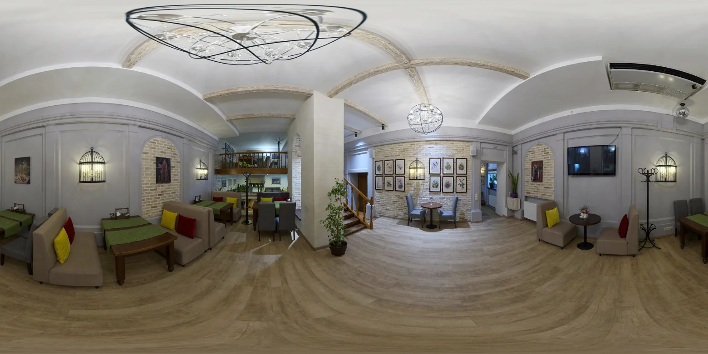

# Web VR Template for Babylon.js

*A Babylon.js template project you can use as the basis for your own WebXR-based VR projects.* 

https://user-images.githubusercontent.com/1727699/190291889-2eb0b9b0-2b5a-4b15-8924-08e33d39d7ec.mp4

## Introduction

This project was created with to main goals...

1. Provide a pleasant, efficient developer workflow
2. Provide a simple yet complete example of a VR application built with Babylon.js

This template project offers...

- Great code completion support and code validation via **TypeScript**
- Easy, efficient code packaging via **Webpack**
- A "Loading" screen that can be customized easily using plain **HTML and CSS**
- A "Welcome" screen that can also be customized using **HTML and CSS**
- A simple lighting setup that uses image-based lighting for great looking lighting that works well with PBR (Physically Based Rendering) materials
- A simple, aesthetically pleasing 3D environment
- A button to enter VR mode
- VR teleportation

## Getting Started

### Prerequisites

- Basic knowledge of TypeScript
- [Node JS](https://nodejs.org/en/) installed
- (Recommended) [VS Code](https://code.visualstudio.com/) installed including the following extensions:
  - [ESLint](https://marketplace.visualstudio.com/items?itemName=dbaeumer.vscode-eslint)
  - [HTML CSS Support](https://marketplace.visualstudio.com/items?itemName=ecmel.vscode-html-css)

### First Time Setup

1. Download this repository.
2. In a terminal window, `cd` to the root of this project.
3. Run `npm install` to install necessary dependencies

🎉 That's it! You're now ready to start modifying the code.

### Development Workflow

One useful feature of this project is that it provides a local webserver enabling you to preview your running application _while you code_. This server is able to detect edits to your code and automatically reloads them in the browser as you work, providing a great iterative development workflow.

To start the preview server:

1. Open a terminal window.
2. `cd` to the root of the project.
3. Run `npm run start`. 

This will build the project, launch the application in a browser, and begin monitoring for changes to the source code. As you make edits, the browser will automatically update to reflect your changes. (For HTML edits you will have to manually reload the browser.)

When you are done using the preview server, enter **CTRL-C** in the terminal to stop the server.

> ✏️ **Note:** If you are doing your development on a computer that doesn't support VR (e.g Mac) or do not have a compatible VR headset attached, you will not be able to test the VR functionality using the local preview web server. Instead, you will need to create a distribution build and host the build artifacts from a publicly accessible web server. See the next section for details.

### Distributing the Finished Application

When you're ready to share your application with the world (or ready to test it from a wireless VR headset) you will create a distribution build by doing the following.

1. Open a terminal window.
2. `cd` to the root of the project.
3. Run `npm run build`. This will create build artifacts and place them in a folder called "dist".
4. Upload the contents of the resulting "dist" folder to your web server of choice.

> 💡 **Tip:** If you need an inexpensive, easy way to host web content, I suggest giving [AWS Amplify](https://aws.amazon.com/amplify/) a try!

## Source Code Tour

The following will orient you to the code files in this project.

### TypeScript Classes

- **SceneBase** - Extends the Babylon.js **Scene** class. This base class is responsible for setting up the lighting, 3D environment, and default (non-VR) camera.
- **VrSceneBase** - This class extends **SceneBase**, adding VR capabilities like teleportation.
- **DemoScene** - This class extends **VrSceneBase** and can be edited to add your own custom content and interactivity to the scene.

### Other Files

- **index.html** - This file defines the general layout of the application, including the 3D render canvas as well as the "Loading" and "Welcome" screens.
- **index.css** - Contains all the CSS styles for the application.
- **index.ts** - This is the Javascript entry point for the application. It bootstraps the application by initializing Babylon.js and loading the DemoScene.

## Customizing the App

The following will guide you in common customizations that you may want to make.

### Load Your Own 3D Model

In the **DemoScene.ts** file, edit the `loadHeroMesh()` method.

### Customize the "Loading" screen

In the **index.html** file, edit the `
` with the id *"loadingScreen"*. Related classes in the **index.css** file include `.loadingScreen` and `.screen`.

### Customize the "Welcome" screen

In the **index.html** file, edit the `
` with the id *"welcomeScreen"*. Related classes in the **index.css** file include `.screen` and `.panel`.

### Change the Lighting

The lighting in the scene is provided by two light sources - an **image-based light** which provides about 90% of the lighting, and a **directional light** which is primary used to cast shadows. Image-based lighting (IBL) is an easy and powerful way to get realistic lighting in a scene. IBL uses special 360º photos called High Dynamic Range (HDR) images as a lighting source. These HDRs make it easy to simulate the lighting from real-world locations.

The HDR image that this project uses is ["Comfy Café"](https://polyhaven.com/a/comfy_cafe) and looks like this...

If you'd like to use a different image for your lighting, you'll find may wonderful free HDR images at [PolyHaven.com/hdris](https://polyhaven.com/hdris). Using one of these images in Babylon.js requires the following steps...

1. Find an HDR image you like. Download it. If you download an image from PolyHaven.com, select the "1K", "HDR" format version of the image.
2. Load the **Babylon.js IBL tool** in your browser: https://www.babylonjs.com/tools/ibl/
3. Select the HDR image you downloaded (it should have an `.hdr` file extension), and drag-drop it onto the IBL tool.
4. After a moment of processing you will be prompted to save the result. Save it to the project folder as: `<project root>/assets/textures/environment.env`

The next time you load the application in the browser it will use your new lighting image.

If you want to make more significant lighting changes, including changing the intensity of the lights, you can do so in the **SceneBase.ts** file by editing the `setUpLighting()` method.

## Credits

I would like to thank the following creators whose assets are used in this project...

["Toy plane" model](https://sketchfab.com/3d-models/toy-plane-9b4e13700da14d31b9d923c499e18f64) by **Law**. License: [CC Attribution](http://creativecommons.org/licenses/by/4.0/)

["Comfy Café" HDR image](https://polyhaven.com/a/comfy_cafe) by **Sergej Majboroda**. License: [CC0](https://polyhaven.com/license)

